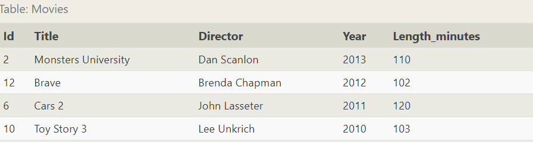
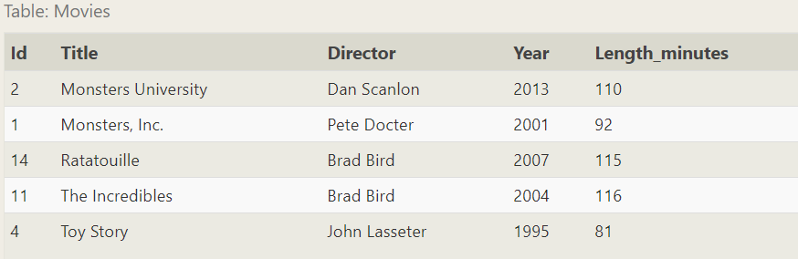
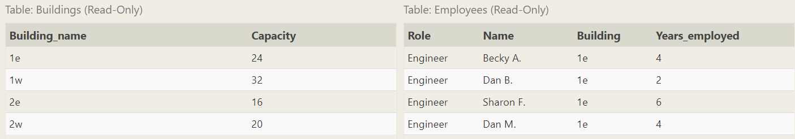
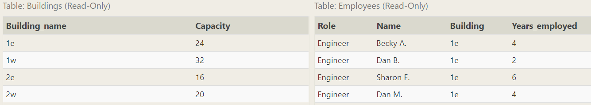
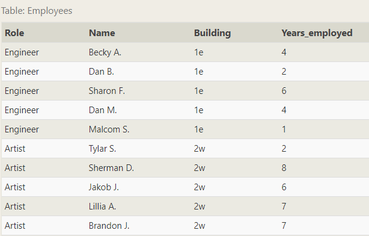

### 1. SELECT
```SQL
SELECT * FROM table_name;
```

### 2. Queries with constraints
- WHERE clause
```sql
SELECT column,...
FORM table
WHERE condition
```

Operator | SQL Example
:-: | :-:
BETWEEN ... AND ... | clo_name **BETWEEN** 0.5 **AND** 1.5
NOT BETWEEN ... AND ... | clo_name NOT **BETWEEN** 2000 **AND** 2010
IN (...) | clo_name **IN** (1, 3, 5)
NOT IN (...) | col_name **NOT IN** (1, 3, 5)
<center>表1</center>

Operator | Condition | Example
:-: | :-: | :-:
LIKE | Case insensitive exact string comparison | col_name **LIKE** 'abc'
NOT LIKE | Case insensitive exact string inequality comparison | col_name **NOT LIKE ** 'abc'
% | Match(only with LIKE or NOT LIKE | col_name **LIKE** '%hello%'
_ | Used to match a single character(only with LIKE or NOT LIKE) | col_name **LIKE** "AN_"
IN (...) | String exists in a list | col_name **IN** ("A", "B")
NOT IN (...) | String does not exit in a list | col_name **NOT IN** ("C", "E")
<center>表2</center>

```sql
SELECT column,...
FORM table
WHERE condition
  AND/OR another_condition
```

### 3. Filtering and sorting Query results
- Unique results
```sql
SELECT DISTINCT column, another_column, ...
FROM table_name
WHERE condition(s)
```
- Ordering results
```sql
% Select query with ordered results
SELECT column, another_column, ...
FROM table_name
WHERE condition(s)
ORDER BY column ASC/DESC;
```
- Limiting results to a subset
```sql
% Select query with limited rows
SELECT column, another_column, ...
FROM table_name
WHERE condition(s)
ORDER BY column ASC/DESC
LIMIT num_limit OFFSET num_offset % offset偏移量
```

eg.

> List the last four Pixar movies released (ordered from most recent to least) 

```sql
SELECT * FROM movies
ORDER BY year DESC
LIMIT 4;
```



eg.

> List the **next** five Pixar movies sorted alphabetically

```SQL
SELECT * FROM movies
ORDER BY title ASC
LIMIT 5 OFFSET 5;
```



### 4. Multi-table queries with JOINs
>JOIN clause

- INNER JOIN
```sql
% Select query with INNER JOIN on multiple tables
SELECT column, another_table_column, ...
FROM mytable
INNER JOIN another_table
  ON mytable.id = another_table.id
WHERE condition(s)
ORDER BY column, ... ASC/DESC
LIMIT num_limit OFFSET num_offset;
```
A process that matchs rows from the first table and the second table with 
have the same key to create a result row with combined columns from both 
tables.

eg. 
```sql
SELECT title, rating
FROM movies
  JOIN boxoffice
    ON movies.id = boxoffice.movie_id
ORDER BY rating DESC;
```

### 5. OUTER JOINs
```sql
%Select query with LEFT/RIGHT/FULL JOINs on multiple tables
SELECT column, another_column, ...
FROM mytable
INNER/LEFT/RIGHT/FULL JOIN another_table
  ON mytable.id = another_table.matching_id
WHERE condition(s)
ORDER BY column, ... ASC/DESC
LIMIT num_limit OFFSET num_offset;
```

> When joining table A to table B, a `LEFT JOIN` simply includes rows from A regardless of whether a matching row is found in B. The `RIGHT JOIN` is the same, but reversed, keeping rows in B regardless of whether a match is found in A. Finally, a `FULL JOIN` simply means that rows from both tables are kept, regardless of whether a matching row exists in the other table.

eg.

> List all buildings and the distinct employee roles in each building (including empty buildings)



```sql
SELECT DISTINCT building_name, role FROM buildings
LEFT JOIN employees
  ON buildings.building_name = employees.building
```


### 6. A short note on NULLs

> Test  a column for NULL values in a **WHERE** clause by using either **IS NULL** or **IS NOT NULL** constraint.

```sql
%Select query with constraints on NULL values
SELECT column, another_column, ...
FROM mytable
WHERE column IS/IS NOT NULL
AND/OR another_condition
```

eg. 

> Find the names of the buildings that hold no employees.



```sql
SELECT DISTINCT building_name
FROM buildings 
  LEFT JOIN employees
    ON building_name = building
WHERE role IS NULL;
```

*此题需要仔细思考一下*

### 7. Queries with expressions

```sql
% Select query with expression aliases
SELECT col_expression AS expr_description, ...
FROM table;
```

```sql 
% Example query with both column and table name aliases
SELECT column AS better_column_name, ...
FROM complex_table_name AS easy_table_name;
```

### 8. Queries with aggregates(Pt.1)

```sql
% Select query with aggregate function over all rows
SELECT AGG_FUNC(column_or_expression) AS aggregate_description, ...
FROM table
WHERE constraint_expression;
```

- Common aggregate functions

| **Function** |
| ------------ |
| COUNT(*)     |
| MIN(column)  |
| MAX(column)  |
| AVG(column)  |
| SUM(column)  |

- Grouped aggregate functions

```sql
% Select query with aggregate functions over groups
SELECT AGG_FUNC(column_or_expression) AS aggregate_expression, ...
FROM table
WHERE constraint_expression
GROUP BY column;
```

> The **GROUP BY** clause works by grouping rows that have the same value in the column specified.

### 9.  Queries with aggregates (Pt. 2)

```sql
% Select query with HAVING constraint
SELECT group_by_column, AGG_FUNC(column_expression) AS aggregate_result_alias, ...
FROM table
WHERE condition
GROUP BY column
HAVING group_condition;
```

> The **HAVING** clause constraints are applied to the grouped rows.
>
> The `HAVING` clause constraints are written the same way as the `WHERE` clause constraints.

eg.

> Find the total number of years employed by all Engineers



```sql
SELECT role, SUM(years_employed)
FROM employees
GROUP BY role
HAVING role = "Engineer";
```

result


